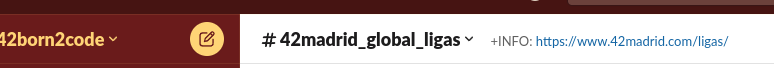
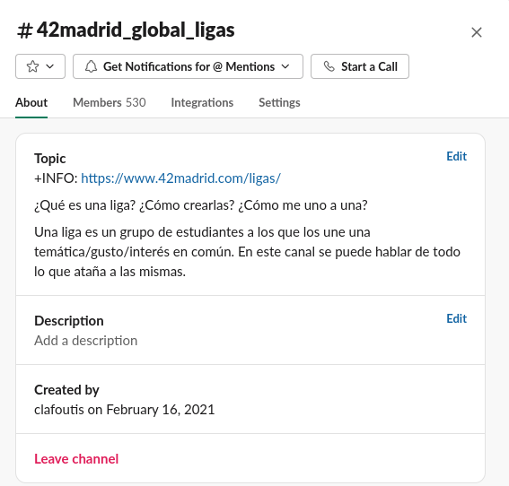
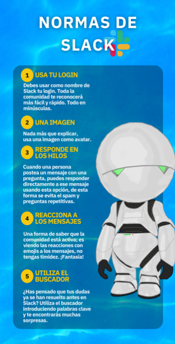
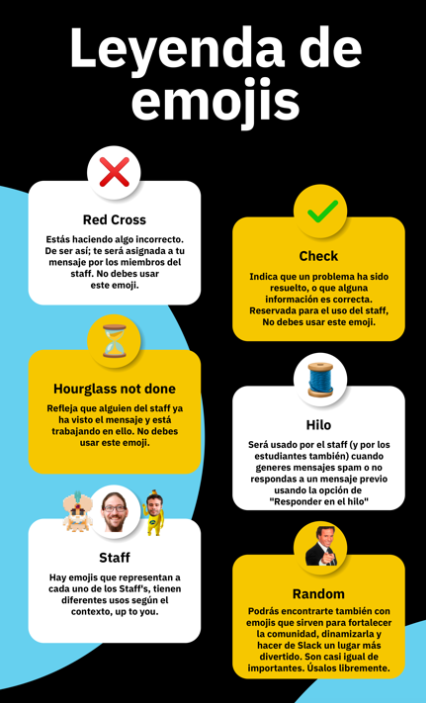
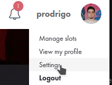

# Welcome back, traveler.

Hola, viajero [[ espacial ]], es posible que te haya tragado un Black Hole y has acabado en otro universo después de un tiempo, o probablemente me equivoco y vengas de cierto lugar [[ acuático ]].
De igual manera, quizá prefieras ciertos consejos [[ personales ]] para ponerte un poco mas comod@.

## Time to be a BIG SHOT (within the rules).

Quizá no venga mal repasar las [guías de convivencia y del edificio](https://github.com/42MadridFT/Guia).
Les falta una [[ actualización ]] en algunos puntos, pero te puedes hacer la idea general. Por otra parte, me gustaría comentar un par que se incumplen normalmente:


- Por favor, no echeis líquidos en las máquinas de agua, no tienen un desagüe y se llenan con facilidad, además que luego hay que limpiarlo.
- No dejeis botellas de agua encima de las mesas de los cluster. Personalmente recomiendo no llevar líquidos encima, en general.
- No, si hay piscineros NO podeis entrar en los cluster designados a ellos, a no ser de que se especifique lo contrario.
- El campus es de todos, y como tal, hay que cuidarlo y mantener una limpieza decente. Los envases a sus respectivos contenedores, y si se deja migas o algo por el estilo, o un derrame, tratar de limpiarlo. Esto tambíen se aplica a las duchas y baños, hay que intentar mantenerlos limpios.

Para mas información, podeis consultar los [TIGs](https://meta.intra.42.fr/articles/reglas-de-conducta-y-tig)

Si cometeis una infracción, se os bloqueara el acceso a la intra hasta que cumpláis el TIG. Para cumplirlo, debereis presentaros el día que queráis a las 10 AM.

Ante dudas, podeis preguntar al staff, cuya información de cada miembro tendréis al lado de la sala de dicho personal con foto incluida.

Por otra parte, estaría bien que repasaras las reglas de Slack, pero lo veremos más tarde en este manual.

## From zero to hero (or not).
Nuevamente, mi recomendación personal, pero muchas personas o bien tendrán el escritorio lleno de   [[ INFORMACION CONFIDENCIAL ]], o tendrán muchas aplicaciones antiguas que ya no sirven o están deprecadas.

Te recomiendo que hagas una copia de seguridad ya sea a través de GitHub o a través de goinfre (en general mejor GitHub, ya deberías estar subiendo tus proyectos a un repositorio personal privado) y hacer un reset a tu usuario. Para ello, abre una terminal y pon
> touch ~/.reset

Obviamente esto es completamente opcional y no tienes por que hacerlo, pero es una opción cuando te empiece a dar problemas el Mac por falta de espacio.

## Intranet
Lo primero que deberías abrir sería tu sesion en la [Intranet](https://intra.42.fr). Es recomendable que abras slots de corrección en el tiempo que vayas a estar en el campus:
`Click en tu perfil > Manage Slots > Selecciona un rango de tiempo para corregir`

En [los notions](https://elearning.intra.42.fr/notions) teneis bastante información para hacer proyectos. No olvideis la carpeta sgoinfre para aquellos que requieran mas espacio de lo habitual.

### Workflow
<hr>
Para trabajar en 42 vas a necesitar una serie de herramientas básicas. Algunas, como ya verás, son de uso obligatorio, otras, en cambio, son de libre elección. En cualquier caso, todas ellas están aquí para hacer tu día a día más llevadero, y hasta cierto punto es importante conocer la existencia de todo el espectro para poder contrastar correctamente los pros y los contras, y así poder elegir correctamente (en aquellas que puedes), ya que te van a acompañar durante muchos años.

Abarquemos primero el tema menos interesante: las herramientas que debes usar, aquellas que te van a servir de interfaz directa con 42 y así se eligieron en los albores de los tiempos. Luego pasaremos a lo más interesante, donde te vas a poder expresar según tus gustos y opiniones (y donde probablemente pierdas más tiempo personalizando tu espacio de trabajo).

### Herramientas de uso obligatorio
<hr>
<details>
  <summary style="font-size:1.2em;">
  Git
  </summary>

<pre style="height:15em;width:5empx;border:1px solid #ccc;font:16px/26px Georgia, Garamond, Serif;overflow:auto;">
Al principio de los tiempos existían los protoplanetas, pedacitos de roca diseminados de manera caótica en lo largo y ancho de la galaxia. La gente trabajaba sobre ellos sin control alguno, cogiendo de aquí y allá lo que les convenía, formando pedazos de roca más grande a los que tenían la valentía de llamar planetas. Ahora, eso no era tarea sencilla, los errores eran comunes y catastróficos. Pero como no tenían traza alguna de que ni de donde venían los pedazos que formaban sus planetas, eran incapaces de volver sobre sus pasos para encontrar el origen de un planeta mal formado. Así no les quedaba otra que desechar meses de trabajo y volver a empezar. Tras un tiempo de trabajo con esta dinámica primitiva, y ya habiendo adquirido consciencia colectiva de que no era posible hacer nada mínimamente complejo, y que así pudiera albergar vida, algún ilustrado anónimo vio a bien guardar las etapas de la construcción de su planeta en pequeñas cajas de madera (archivos comprimidos). De la misma forma que uno se guarda las partidas de un juego para poder reintentar los niveles con distintas estrategias. De esta forma, en cuanto nuestro ser ilustrado veía que su planeta no iba por buen camino, volvía a rebuscar en la última caja que sabía que podía servirle como base de un buen planeta, y retomaba el trabajo desde ese punto. Así pues, las civilizaciones constructoras de planetas ya no tenían que empezar de cero cada vez que cometían un fallo. Sin embargo, con el tiempo, ya habiendo olvidado la caótica actividad de no tener puntos de guardado, y deseando invertir tiempo no en el trabajo en sí, sino en un sistema control de dicho trabajo, empezaron a idear formas mejores de aplicar la misma idea de base (tener pequeñas cajas que representaban una etapa concreta de su trabajo) pero de forma más automática, intentando que estuviera en la medida de lo posible en un segundo plano, y así pudieran concentrarse de pleno en la complejidad que es construir un planeta.
</pre>
De esta forma nacieron los sistemas de control de versiones ([VCS](https://en.wikipedia.org/wiki/Version_control)) en su forma más primitiva. Entre ellos podemos contar con [SCCS](https://en.wikipedia.org/wiki/Source_Code_Control_System), [RCS](https://en.wikipedia.org/wiki/Revision_Control_System) y [SVN](https://subversion.apache.org/) (Aún hay empresas que usan Subversion!). Algunos de estos antiguos sistemas de control de versiones contaban con muchas características de las que podemos ver reflejos en los sistemas más modernos. Como por ejemplo la existencia de ramas de trabajo. Así múltiples personas pueden trabajar sobre la misma base sin chafarse los unos a los otros. O los tags/releases, para poner una bandera en las etapas estables del proyecto que representan una unidad funcional. Con todo, y para los estándares modernos esto no era suficiente. Estas herramientas, aunque suponiendo un gran paso respecto al salvaje oeste que en el que vivían los primeros desarrolladores, seguían estorbando considerablemente. No eran suficientemente inteligentes para suplir las problemáticas con las que el desarrollador moderno se encuentra en su día a día. Así pues, Linus Torvalds, en su encíclica cruzada, vino a solventar los mundanos problemas del ingeniero moderno, abriendo la veda a los sistemas de control de versiones modernos. Nació [Git](https://git-scm.com/). Con esta futurista herramienta, los nuevos programadores tenían a su disposición una navaja suiza para cortar, coser, solapar y quimerizar su código a gusto y sin limitaciones. Trayendo consigo nuevas herramientas como [cherry picking](https://git-scm.com/docs/git-cherry-pick), [bisect](https://git-scm.com/docs/git-bisect), [rebase](https://git-scm.com/docs/git-rebase) y muchas más.

Contada esta pequeña historia sobre los sistemas de control de versiones, como es evidente, la elección de 42, y, por tanto, nuestra obligación, es aprender y usar Git. Esta es tu interfaz para publicar código en los servidores de 42. Así otros alumnos, principalmente tus correctores o compañeros de equipo pueden acceder a tu trabajo para revisarlo, modificarlo y demás. Por lo tanto, es altamente recomendado adquirir un conocimiento profundo sobre el mismo, porque, no nos engañemos, también será tu herramienta cuando plantes los pies en el terreno de la empresa.

Hay múltiples interfaces para trabajar con Git, tanto de línea de comandos como interfaces gráficas. Sin embargo, es **altamente** recomendable (por no decir moralmente obligatorio) dominar Git en todo su esplendor desde la interfaz de comandos oficial. Es de hecho muy probable que si así lo haces, y una vez te acostumbres, no quieras usar ninguna interfaz más. Pues Git es un proyecto tan avanzado, son tantas las combinaciones y opciones que ofrece, que no habrían botones suficientes en ninguna GUI para representarlas. Usando pues el CLI oficial, te pones tú al volante del crucero espacial, porque ya sabemos lo que pasa cuando dejamos demasiada cancha al piloto automático.

`Y no, utilizar Git como Google Drive o simplemente hacer git init && git remote add origin repo && git add * && git commit -m "covfefe" && git push origin main --force no es saber utilizar Git`

Cuando le cojas el tranquillo a la CLI, te recomiendo que utilices la app oficial de Github Desktop para ahorrar tiempo y utilizar una combinación de ambas cosas, a tu gusto. En el campus disponemos de gitkraken, aunque desde mi punto de vista es más complejo que usar la terminal directamente y la interfaz en general es poco intuitiva. Lo único que me gusta de ello es que el editor de conflictos es bastante decente.

Si quieres aprender la utilización de la CLI, y en general entender mejor el control de versiones, te recomiendo que mires [esta clase de Missing Semester y sus apuntes](https://missing.csail.mit.edu/2020/version-control/).
</details>
<br>

<details>
  <summary style="font-size:1.2em;">
  Slack
  </summary>

Supongo que ya tienes preparado el Slack, pero si no te recomiendo que lo pongas tanto en el mac como en tus dispositivos móviles y te conectes al espacio de trabajo de 42born2code(.slack.com).
Ahí se anuncian todos los comunicados de 42, además de que es el sitio donde preferiblemente debes reportar problemas o dar tus aportaciones. Tendrás que cumplir varias normas en Slack que tocaremos más adelante en la guía **(NO las ignores)**.

Este es el principal medio de comunicación que se utiliza en el campus, aparte de los emails. Una vez entres al campus, seguramente te llegará una invitación para registrarte. La dirección del slack es **42born2code.slack.com**, por si tienes que ingresar manualmente. El correo que deberás usar será probablemente **(username)@student.42madrid.com**.

``Es muy recomendable que utilices tu nombre de usuario en slack como el Display Name, y el Full Name tu Nombre y Apellidos completos.``

Una vez hecho esto, tendrás un par de canales a tu disposición. Te recomiendo que añadas el resto de tu campus, dandole al icono de + y buscando los canales por 42(tucampus)\_ `Ex: 42Madrid_`.

> Slack me da asco porque me pide updates cada dos minutos

Cool. Puedes poner en tu terminal:

```
defaults write Library/Preferences/com.tinyspeck.slackmacgap.plist SlackNoAutoUpdates -bool YES
```

Y el problema se acaba.

Algunas normas del slack que debes saber son:
- Los mensajes en cada canal deben empezar en un hilo y, si es necesario, seguirse dentro del mismo hilo. Es decir:
<hr>

   + Comienzo del hilo:
   		+ Mensajes dentro del hilo

<hr>

 Y no:

<hr>
<ul>
	<li>Comienzo del hilo</li>
	<li>Otro mensaje en otro hilo relacionado con el hilo anterior</li>
</ul>
<hr>


- Las imágenes SOLO estan permitidas dentro de los hilos, excepto en los canales \_random.
- Cada canal tiene su propio tema/objetivo, lee las descripciones de los canales para ver qué va en cada canal. Por ejemplo, la mayoría de problemas con los mac va en el canal de \_it.




- El canal de ligas NO se usa para que te metan en una liga, para ello pregunta a los responsables de cada liga que se pueden ver en la [pagina de 42madrid](src="https://www.42madrid.com/ligas/)(o en la descripcion del canal).
- El canal de MSC, para pedir actualizaciones de programas o programas en sí, tiene un template que hay que seguir.


**¿Hay más normas o no te queda claro?** Consulta estos diagramas hechos por el staff:
<p>



</p>

Por otra parte, el general y el random son canales que siempre se agradece tener vivos, así que no os corteis por usarlos.
</details>
<br>

<details>
  <summary style="font-size:1.2em;">
  Norminette
  </summary>


Norminette por defecto está instalado en los campus, pero si quieres usarlo en tu ordenador (Se recomienda, por lo general, [Ubuntu ~y posiblemente en el campus sera usado en el futuro~)](https://42born2code.slack.com/archives/CN3D33GRX/p1658235229616819) tendrás que hacer ciertas modificaciones.

La [Norminette](./assets/docs/en.norm.v3.pdf) ha cambiado a la versión 3, así que conviene que repaseis vuestros proyectos anteriores si no lo habeis hecho para que no os lleveis sustos.

Para instalar norminette, en una terminal de Ubuntu:

```
sudo apt install python3 python3-pip
python3 -m pip install --upgrade pip setuptools
python3 -m pip install norminette
```

Si se necesita actualizar:

`python3 -m pip install --upgrade norminette`

Para usarlo, simplemente

`norminette filename [...]`

Recuerda que norminette no funciona con archivos que no sean .c o .h

</details>

<br>

### Herramientas de libre eleccion
<hr>
<br>
<details>
  <summary style="font-size:1.2em;">
  La Terminal
  </summary>

Dentro de las cosas que de las que tenemos el gusto de poder elegir, una es la terminal. Esta será tu puerta de entrada y canal de comunicación con tu sistema operativo (tanto da si es GNULinux, OSX, o dios no lo quiera Windows). Lo hacemos llamar terminal, pero en realidad su nombre real viene precedido de "emulador", emulador de terminal, ya que nos encontramos muy lejos de las antiguas terminales hardware de los inicios de la informática (de ahí el nombre de [tty o Terminal Teletype](http://www.linusakesson.net/programming/tty/index.php)).

Como aplicación que es, tenemos un gran catálogo en formas, colores, y sabores. De todas las cosas que puedes elegir, quizás esta sea la que menos va a sumar en tu recorrido por 42. Aun así, vale la pena darle un vistazo a las muchas opciones que hay y las funcionalidades que ofrecen. Te dejo una lista de las más famosas por aquí:

- [Alacritty](https://github.com/alacritty/alacritty)
- [Yakuake](https://apps.kde.org/yakuake/)
- [Terminator](https://gnome-terminator.org/)
- [Guake](http://guake-project.org/)
- [Tilda](https://github.com/lanoxx/tilda)
- [St](https://st.suckless.org/) (Pegale un ojo al software que hace la gente de [suckless.org](https://suckless.org/))

La terminal por defecto de los ordenadores de la 42 (OSX por ahora) es [iTerm2](https://iterm2.com/).


</details>
<br>


<details>
  <summary style="font-size:1.2em;">
  La Shell
  </summary>

Siguiendo el orden lógico de las cosas, después de la terminal viene la shell, una terminal no es nada sin una shell que se ejecute dentro de ella, y la shell no es más que una aplicación interactiva en la que mediante comandos vas a poder comunicarte con tu sistema operativo de elección. De nuevo aquí contamos con una amplia gama de opciones, sin embargo, en esto tenemos un handicap que considerar de unas respecto a las otras. Para entender la importancia de este handicap, es necesario primero que os introduzca el sistema [POSIX](https://en.wikipedia.org/wiki/POSIX) (grabad este nombre a fuego en lo más hondo de vuestro hipotálamo, pues es de las cosas más importantes que podéis aprender). No voy a alargarme mucho en esta explicación, pues en sí, POSIX es de carácter puramente teórico, y, por lo tanto, hay toneladas de información en la web. Para definirlo de forma rápida, POSIX es un estándar de interfaces, es decir, una guia para que todos los programadores del mundo nos pongamos de acuerdo en la forma con la que nos comunicamos con nuestro ordenador. De forma que, no importe en que sistema operativo estemos, ni que hardware tengamos, ni que dispositivos hayamos conectado a nuestro ordenador, la forma de comunicación siempre será la misma. Por así decirlo POSIX es a la comunicación con nuestro ordenador, como el inglés es a la comunicación entre personas: Todos acordaron que es el método oficial; no tantos como quisiéramos lo hablan correctamente; y muchos lo hablan pero a medias. Por ejemplificar GNULinux es el sistema más POSIX que podemos encontrar. OSX estaría por ahí en medio tonteando con POSIX. Y Windows es simplemente un desastre y va a su bola (hay por ahí un proyecto en el que están haciendo de Windows un sistema POSIX, pero ya veremos).

¿Y a que viene todo esto para elegir nuestra shell? Pues bien, siendo rigurosos, [Bash](https://www.gnu.org/software/bash/) es la única shell que es POSIX. Por tanto, os **recomiendo encarecidamente** que durante vuestro aprendizaje, y antes de pasar a alternativas más sofisticadas, aprendáis Bash hasta que os sintáis capaces de generar la piedra filosofal con ella.

Os dejo por aquí las tres shells mas famosas en orden descendente de POSIX-compilant:

- [Bash](https://www.gnu.org/software/bash/)
- [Zsh](https://www.zsh.org/)
- [Fish](https://fishshell.com/)


  
</details>
<br>


<details>
  <summary style="font-size:1.2em;">
  El Editor
  </summary>
<pre>
Oh, el eterno dilema. El editor que elijas usar va a ser la decisión más importante que debas tomar en esta: Tu cruzada. Esta elección te situará irremediablemente en un bando del que no podrás huir. Correrán por su nombre caudalosos ríos de sangre y vísceras. Y morirás defendiendo el bastión hasta el último aliento.
</pre>

Antes de los hombres no había nada, un eterno vacío. Luego, en los albores de la civilización se forjaron en ríos de lava [Emacs](https://www.gnu.org/software/emacs/) y [Vi](https://en.wikipedia.org/wiki/Vi). Entonces la [eterna guerra](https://en.wikipedia.org/wiki/Editor_war) por el control estalló, y perdura hasta estos días.

Siguiendo una tradición ancestral, 42 ofrece por defecto dos editores: [Emacs](https://www.gnu.org/software/emacs/) y [Vim](https://en.wikipedia.org/wiki/Vim_(text_editor)). Tomándonos un poco más en serio esta sección, esta no es una decisión tomada a la ligera. Sendos editores, aun siendo intrínsecamente distintos de base, cumplen una serie de funciones que jamás hay que subestimar. En primer lugar, os permiten editar ficheros (recordemos que UNIX todo, [absolutamente todo son ficheros](https://en.wikipedia.org/wiki/Everything_is_a_file)!), con lo que va a ser vuestra principal herramienta de trabajo, donde más tiempo vais a pasar. Seguidamente, estos, por defecto, son editores planos, ofrecen una mínima ayuda a su usuario. ¡Y esto es muy bueno! Como aprendices os va a obligar a bajar a las trincheras, a pelear por vuestro código. En un principio será una ardua tarea. No va a ser cómodo. Pero poco a poco todo ese trabajo va a ir generando valor. El conocimiento que vais a ir adquiriendo de forma tanto directa como colateral (vais a acabar informándoos de muchas cosas por el camino hasta desenterrar exactamente lo que queréis) se va a ir sedimentando en la base de vuestro cráneo. Y llegado un punto, os daréis cuenta de que muchas cosas que antes se os trababan en la punta de los dedos, ahora os fluyen naturalmente y sin esfuerzo. ¡Ésta es la metodología 42!

Por lo anteriormente dicho, os recomiendo una, dos, y tres veces resistir la tentación de los editores que, por defecto, os dan la mayoría del trabajo hecho y toda la información que omitís con ellos es realmente valiosa. Pero que esto no os desanime, tanto Emacs como Vi son capaces de hacer todas las virguerías que susodichos editores tienen por defecto. Ambos tienen lenguajes de configuración muy avanzados (Sobre todo Emacs, ya lo veréis cuando investiguéis). Y no solo eso, la comunidad que los rodea es inmensa, hay una cantidad abismal de paquetes hechos por usuarios que os ofrecen toda clase de mágicas conjuras. Eso si, debéis de nuevo de bajar al barro a recoger lo que deseáis. Seréis vosotros mismos quienes construyáis vuestro propio editor!

A modo de nota, quiero recalcar que estos dos no son los únicos editores que considerar. Sí es cierto que son los más comunes de su tipo, y, por tanto, los que más pueden escalar y más mantenimiento tienen. La idea importante que extraer de esta sección, es la de no intentar echarse a correr, cuando aún estamos aprendiendo a gatear. Los cimientos son importantes, te permiten construir de forma muy robusta sobre ellos si están bien falcados.

</details>
<hr>

### FAQ
<hr>

- **No puedo subir mis proyectos, me da error de key!**

Necesitareis key ssh para subir los proyectos, os recuerdo como hacerlo en este post [Medium](https://medium.com/my-journey-at-42-silicon-valley-as-a-non-cs-major/42-silicon-valley-ssh-access-vogsphere-remotely-2ccf3c4486a)

¿Qué, que no sabes Inglés? Bueno, en este mundillo no llegarás muy lejos sin ello. Pero básicamente es:

> ssh-keygen -t ecdsa
>
> `Enter (o pon la contraseña que tu quieras)`
>
> cd .ssh
>
> cat *.pub
>
> Copia el output que te ha dado el comando (ecdsa-sha2-nistp256 ....)
>
> Login en la intra
>
> Ve a tu perfil > Settings

<br>



<br>

> SSH Key

<br>


<br>

> Añadir, le pones el título que quieras y pegas el output de cat *.pub

<hr>

- **Me ha dado error de login me pone noseque de ISCSI y no carga nada y me he logueado en 14 diferentes ordenadores AAAAAAAAAAAAAAAAAA AIUDA!!11!!!!**

Citando a **El Fourbo**

>Cuando tenéis un problema y que pone un mensaje ISCSI, NO sirve a nada probar en un otro ordenador! No va a funcionar y por cada ordenador vamos a tener que matar el programa iscsi y reiniciarlo. Si hay mas de 2 tenemos que resetear el home.

<hr>

- **Le he dado a restaurar de fabrica al Docker y se me ha quedado mas tieso que una regla y no puedo salir de mi sesión.**

Abre el Activity Monitor (El equivalente al Task Manager de Windows) y acaba con el proceso de Docker, o bien
>man ps
>man kill

y a jugar (TIP: ps -ef y kill PID).

- **Quiero caer bajo las garras del capitalismo y gastar dolares en la tienda, ¿como reclamo mis COSAS?**

Ve al Staff.

### Enlaces Interesantes
> [https://github.com/Blackmanx/42madrid-toolbox](https://github.com/Blackmanx/42madrid-toolbox)

Un fork de [42Toolbox](httxips://github.com/alexandregv/42toolbox) que ire tocando para nuestras necesidades.
>[https://github.com/agavrel/42_CheatSheet](https://github.com/agavrel/42_CheatSheet)

Un repositorio con ciertos consejos de C y proyectos del campus de parte de un fellow student.

### Ending
<hr>

De momento esta guía aun necesita muchos retoques, pero creo que está bien para calentar y tener una idea de que tienes que hacer al empezar. Podeis contactarme en slack si quereis hacer un pull request o vuestra contribución.


