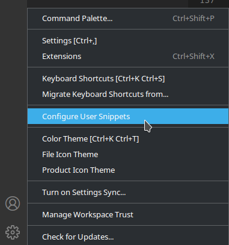

# Welcome back, traveler.
Hola, viajero [[ espacial ]], es posible que te haya tragado un Black Hole y has acabado en otro universo después de un tiempo, o probablemente me equivoco y vengas de cierto lugar [[ acuático ]].
De igual manera, quizá prefieras ciertos consejos [[ personales ]] para ponerte un poco mas comod@.
# Time to be a BIG SHOT (within the rules).
Quizá no venga mal repasar las [guías de convivencia y del edificio](https://github.com/42MadridFT/Guia).
Les falta una [[ actualización ]] en algunos puntos, pero te puedes hacer la idea general. Por otra parte, me gustaría comentar un par que se incumplen normalmente:
- Por favor, no echeis líquidos en las máquinas de agua, no tienen un desagüe y se llenan con facilidad, además que luego hay que limpiarlo.
- No dejeis botellas de agua encima de las mesas de los cluster. Personalmente recomiendo no llevar líquidos encima, en general.
- No, si hay piscineros NO podeis entrar en los cluster designados a ellos, a no ser de que se especifique lo contrario.
- El campus es de todos, y como tal, hay que cuidarlo y mantener una limpieza decente. Los envases a sus respectivos contenedores, y si se deja migas o algo por el estilo, o un derrame, tratar de limpiarlo. Esto tambíen se aplica a las duchas y baños, hay que intentar mantenerlos limpios.

Para mas información, podeis consultar los [TIGs](https://meta.intra.42.fr/articles/reglas-de-conducta-y-tig)

Si cometeis una infracción, se os bloqueara el acceso a la intra hasta que cumpláis el TIG. Para cumplirlo, debereis presentaros el día que queráis a las 10 AM.

Ante dudas, podeis preguntar al staff, cuya información de cada miembro tendréis al lado de la sala de dicho personal con foto incluida.

Por otra parte, estaría bien que repasaras las reglas de Slack, pero lo veremos más tarde en este manual.
## From zero to hero (or not).
Nuevamente, mi recomendación personal, pero muchas personas o bien tendrán el escritorio lleno de   [[ INFORMACION CONFIDENCIAL ]], o tendrán muchas aplicaciones antiguas que ya no sirven o están deprecadas. Te recomiendo que hagas una copia de seguridad ya sea a través de GitHub o a través de goinfre (en general mejor GitHub, ya deberías estar subiendo tus proyectos a un repositorio personal privado) y hacer un reset a tu usuario. Para ello, abre una terminal y pon
> touch ~/.reset

Obviamente esto es completamente opcional y no tienes por que hacerlo, pero es una opción cuando te empiece a dar problemas el Mac por falta de espacio.
## Toqueteando la terminal
Dios santo esa terminal por defecto es bastante [[ POCO AGRACIADA]]. Vamos a arreglar eso:
<hr>

Abre iterm2 y arriba en el menú contextual:
>Profiles > Open Profiles > Edit Profiles > Window > Window Columns and Rows

Yo recomiendo personalmente **150C 40R**, porque las ventanas por defecto son demasiado [[ pequeñas ]].
Quizá prefieras también instalar Oh my Zsh, en una terminal escribe: 
> sh -c "$(curl -fsSL https://raw.github.com/ohmyzsh/ohmyzsh/master/tools/install.sh)”

Y, si lo has hecho, instalar el popular tema powerlevel10k.

> git clone --depth=1 https://github.com/romkatv/powerlevel10k.git ${ZSH_CUSTOM:-$HOME/.oh-my-zsh/custom}/themes/powerlevel10k
>
> nano ~/.zshrc


Edita ZSH_THEME de manera que quede así
>ZSH_THEME="powerlevel10k/powerlevel10k"


Guarda con Ctrl + X y seguidamente para aplicar los cambios:
> source ~/.zshrc


Ahora configura powerlevel10k a tu gusto. Te recomiendo que instales las fuentes que te piden.
Congratulations, ya tienes la terminal relativamente bonita!
## Workflow
Para trabajar en 42 supongo que ya tienes preparado el Slack, pero si no te recomiendo que lo pongas tanto en el mac como en tus dispositivos móviles y te conectes al espacio de trabajo de 42born2code(.slack.com).
Ahí se anuncian todos los comunicados de 42, además de que es el sitio donde preferiblemente debes reportar problemas o dar tus aportaciones. Tendrás que cumplir varias normas en Slack que tocaremos más adelante en la guía **(NO las ignores)**.

Después de Slack lo normal es instalar VSCode (a no ser de que seas uno de esos psicópatas que gustan de VIM, que aunque no fuera así deberías tener que manejarlo a un mínimo nivel de guardar archivos, escribir y copiar/pegar textos.) Si eres un psicoVIMpata puedes saltarte la sección de VSCode.


### VSCode
<hr>

VSCode va a ser tu herramienta de trabajo principal para editar código. Es una herramienta multiplataforma, con sincronización incluida o, si no la necesitas, existen variantes FOSS (vscodium). No solo sirve para C, sirve para cualquier tipo de código, aunque no compila al no ser un IDE te permite hacer debugging, además de tener terminales integradas. 

#### Extensiones
Las extensiones de VSCode te permiten añadir más herramientas al editor para hacer el código o el debugging de manera más cómoda. Por ejemplo, tenemos

Un highlighter que nos permite ver los fallos que nos da la Norminette:
>[Name: 42 Norminette Highlighter (3.x)](https://marketplace.visualstudio.com/items?itemName=MariusvanWijk-JoppeKoers.codam-norminette-3)

Un colocador del 42 header (Tendras que editar la configuración de la extensión para poner tu nombre de usuario):
>[Name: 42 Header](https://marketplace.visualstudio.com/items?itemName=kube.42header)


A partir de ahi todo es opcional. Yo personalmente recomiendo [Better Comments](https://marketplace.visualstudio.com/items?itemName=aaron-bond.better-comments), y a partir de ahi es cuestión de buscar por necesidades.

#### Snippets

El prefijo de un snippet (prefix) es la variable que invoca al contenido de este. Por ejemplo, si escribes en VSCode **comment42** te pondrá un comentario compatible con norminette (siempre que lo pongas antes o después de una clase, claro).

Para crear un snippet, dale a **Settings** en **Vscode > Configure User Snippet** y crea un nuevo snippet global, introduciendo esto (aunque te viene una explicación bastante decente comentada):



```
{
    "Comentario": {
        "prefix": "comment42",
        "body": [
          "/*",
          "** * DESCRIPTION",
          "** Description of function",
          "** * @param myParam",
          "** Description of params",
          "** * RETURN VALUE",
          "** Explain what do you return",
          "*/",
          ""
        ],
        "description": "Comentario"
      }
}
```

Una buena gestión de snippets te puede ahorrar bastante tiempo o hacer el código más legible.

### Slack

Este es el principal medio de comunicación que se utiliza en el campus, aparte de los emails. Una vez entres al campus, seguramente te llegará una invitación para registrarte. La dirección del slack es **42born2code.slack.com**, por si tienes que ingresar manualmente. El correo que deberás usar será probablemente **(username)@student.42madrid.com**.

``Es muy recomendable que utilices tu nombre de usuario en slack como el Display Name, y el Full Name tu Nombre y Apellidos completos.`` 

Una vez hecho esto, tendrás un par de canales a tu disposición. Te recomiendo que añadas el resto de tu campus, dandole al icono de + y buscando los canales por 42(tucampus)\_ `Ex: 42Madrid_`. 

Algunas normas del slack que debes saber son:
- Los mensajes en cada canal deben empezar en un hilo y, si es necesario, seguirse dentro del mismo hilo. Es decir:
   + Comienzo del hilo:
   		+ Mensajes dentro del hilo


 Y no:

<ul>
	<li>Comienzo del hilo</li>
	<li>Otro mensaje en otro hilo relacionado con el hilo anterior</li>
</ul>
<hr>

- Las imágenes SOLO estan permitidas dentro de los hilos, excepto en los canales \_random.
- Cada canal tiene su propio tema/objetivo, lee las descripciones de los canales para ver qué va en cada canal. Por ejemplo, la mayoría de problemas con los mac va en el canal de \_it.


- El canal de ligas NO se usa para que te metan en una liga, para ello pregunta a los responsables de cada liga que se pueden ver en la [pagina de 42madrid](https://www.42madrid.com/ligas/)(o en la descripcion del canal).
- El canal de MSC, para pedir actualizaciones de programas o programas en sí, tiene un template que hay que seguir.

Por otra parte, el general y el random son canales que siempre se agradece tener vivos, así que no os corteis por usarlos.

### Proyectos

Como este git es público, y no quiero hacer mucho spoiler, simplemente dire que en [La Intranet](https://elearning.intra.42.fr/notions) teneis bastante información para hacer proyectos. No olvideis la carpeta sgoinfre para aquellos que requieran mas espacio de lo habitual.

La [Norminette](./assets/docs/en.norm.v3.pdf) ha cambiado, así que conviene que repaseis vuestros proyectos anteriores si no lo habeis hecho para que no os lleveis sustos.

### FAQ

- **No puedo subir mis proyectos, me da error de key!**

Necesitareis key ssh para subir los proyectos, os recuerdo como hacerlo en este post [Medium](https://medium.com/my-journey-at-42-silicon-valley-as-a-non-cs-major/42-silicon-valley-ssh-access-vogsphere-remotely-2ccf3c4486a)

¿Qué, que no sabes Inglés? Bueno, en este mundillo no llegarás muy lejos sin ello. Pero básicamente es:

> ssh-keygen -t ecdsa
>
> `Enter (o pon la contraseña que tu quieras)`
>
> cd .ssh
>
> cat *.pub
>
> Copia el output que te ha dado el comando (ecdsa-sha2-nistp256 ....)
>
> Login en la intra
>
> Ve a tu perfil > Settings


> SSH Key 


> Añadir, le pones el título que quieras y pegas el output de cat *.pub

- **Me ha dado error de login me pone noseque de ISCSI y no carga nada y me he logueado en 14 diferentes ordenadores AAAAAAAAAAAAAAAAAA AIUDA!!11!!!!**

Citando a **El Fourbo**

>Cuando tenéis un problema y que pone un mensaje ISCSI, NO sirve a nada probar en un otro ordenador! No va a funcionar y por cada ordenador vamos a tener que matar el programa iscsi y reiniciarlo. Si hay mas de 2 tenemos que resetear el home.

- **Le he dado a restaurar de fabrica al Docker y se me ha quedado mas tieso que una regla y no puedo salir de mi sesión.**

Abre el Activity Monitor (El equivalente al Task Manager de Windows) y acaba con el proceso de Docker, o bien
>man ps
>man kill

y a jugar (TIP: ps -ef y kill PID).

- **Quiero caer bajo las garras del capitalismo y gastar dolares en la tienda, ¿como reclamo mis COSAS?**

Ve al Staff.

### Enlaces Interesantes
> [https://github.com/Blackmanx/42madrid-toolbox](https://github.com/Blackmanx/42madrid-toolbox)  

Un fork de [42Toolbox](https://github.com/alexandregv/42toolbox) que ire tocando para nuestras necesidades.
>[https://github.com/agavrel/42_CheatSheet](https://github.com/agavrel/42_CheatSheet) 

Un repositorio con ciertos consejos de C y proyectos del campus de parte de un fellow student.

### Ending
<hr>

De momento esta guía aun necesita muchos retoques, pero creo que está bien para calentar y tener una idea de que tienes que hacer al empezar. Podeis contactarme en slack si quereis hacer un pull request o vuestra contribución.


